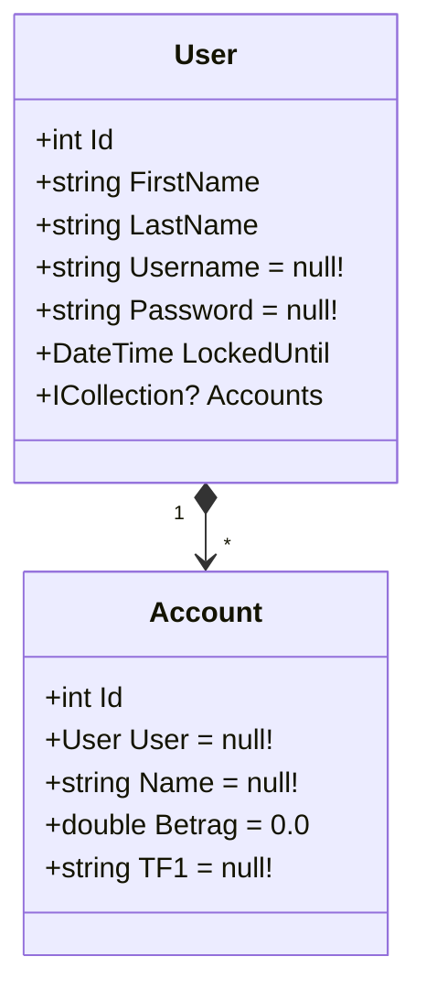
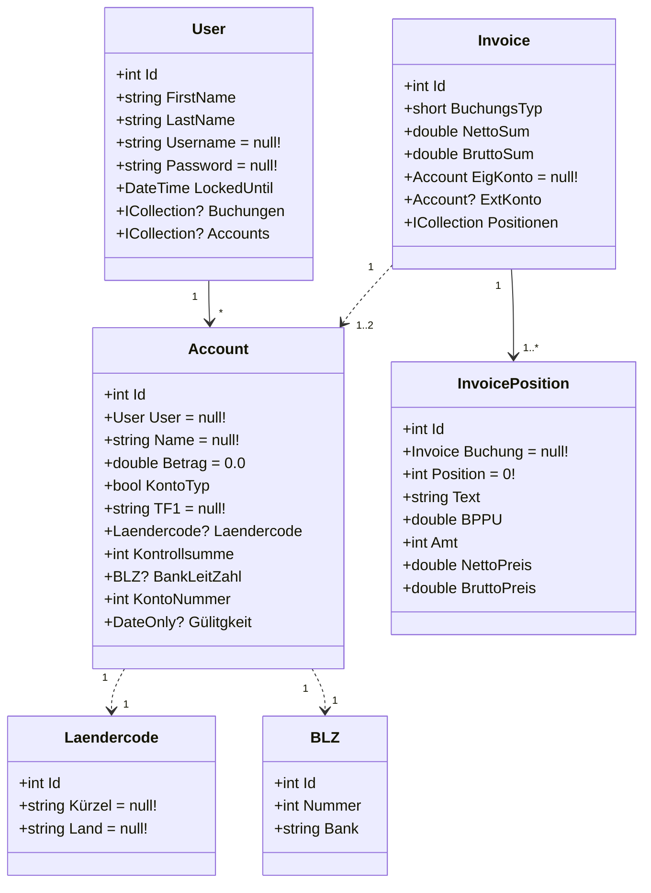

# FiMa Alpha 2

### Datenstruktur (Aktuelle Nutzung)

```mermaid
classDiagram 
User "1" *--> "*" Account

User : +int Id
User : +string FirstName
User : +string LastName
User : +string Username = null!
User : +string Password = null!
User : +DateTime LockedUntil
User : +ICollection<Account>? Accounts

Account : +int Id
Account : +User User = null!
Account : +string Name = null!
Account : +double Betrag = 0.0
Account : +string TF1 = null!
```

### Datenstruktur (Aktueller aufbau in sicht auf zukünftige funktion)

```mermaid
classDiagram
User "1" --> "*" Account
Account "1" ..> "1" Laendercode
Account "1" ..> "1" BLZ
Invoice "1" ..> "1..2" Account
Invoice "1" --> "1..*" InvoicePosition

User : +int Id
User : +string FirstName
User : +string LastName
User : +string Username = null!
User : +string Password = null!
User : +DateTime LockedUntil
User : +ICollection<Invoice>? Buchungen
User : +ICollection<Account>? Accounts

Account : +int Id
Account : +User User = null!
Account : +string Name = null!
Account : +double Betrag = 0.0
Account : +bool KontoTyp
Account : +string TF1 = null!
Account : +Laendercode? Laendercode
Account : +int Kontrollsumme
Account : +BLZ? BankLeitZahl
Account : +int KontoNummer
Account : +DateOnly? Gülitgkeit

BLZ : +int Id
BLZ : +int Nummer
BLZ : +string Bank

Invoice : +int Id
Invoice : +short BuchungsTyp
Invoice : +double NettoSum
Invoice : +double BruttoSum
Invoice : +Account EigKonto = null!
Invoice : +Account? ExtKonto
Invoice : +ICollection<InvoicePosition> Positionen

InvoicePosition : +int Id
InvoicePosition : +Invoice Buchung = null!
InvoicePosition : +int Position = 0!
InvoicePosition : +string Text
InvoicePosition : +double BPPU
InvoicePosition : +int Amt
InvoicePosition : +double NettoPreis
InvoicePosition : +double BruttoPreis

Laendercode : +int Id
Laendercode : +string Kürzel = null!
Laendercode : +string Land = null!
```
