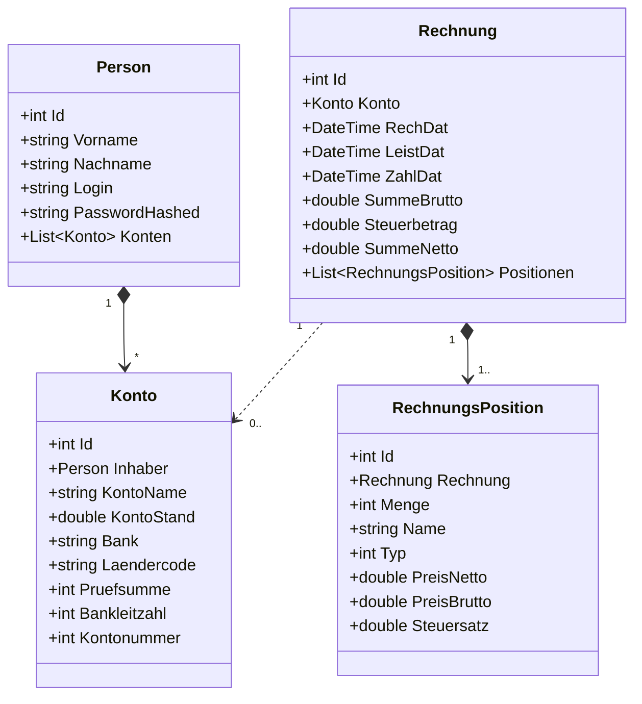
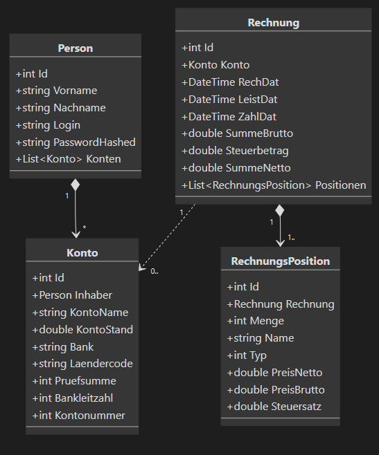

# FiMa Alpha 1

### Datenstruktur

```mermaid
classDiagram 
Person "1" *--> "*" Konto
Rechnung "1" *--> "1.." RechnungsPosition
Rechnung "1" ..> "0.." Konto

Person : +int Id
Person : +string Vorname
Person : +string Nachname
Person : +string Login
Person : +string PasswordHashed
Person : +List~Konto~ Konten

Konto : +int Id
Konto : +Person Inhaber
Konto : +string KontoName
Konto : +double KontoStand
Konto : +string Bank
Konto : +string Laendercode
Konto : +int Pruefsumme
Konto : +int Bankleitzahl
Konto : +int Kontonummer

Rechnung : +int Id
Rechnung : +Konto Konto
Rechnung : +DateTime RechDat
Rechnung : +DateTime LeistDat
Rechnung : +DateTime ZahlDat
Rechnung : +double SummeBrutto
Rechnung : +double Steuerbetrag
Rechnung : +double SummeNetto
Rechnung : +List~RechnungsPosition~ Positionen

RechnungsPosition : +int Id
RechnungsPosition : +Rechnung Rechnung
RechnungsPosition : +int Menge
RechnungsPosition : +string Name
RechnungsPosition : +int Typ
RechnungsPosition : +double PreisNetto
RechnungsPosition : +double PreisBrutto
RechnungsPosition : +double Steuersatz
```

### Programmablauf

### Testbereich (Bitte nicht beachten Thx)

